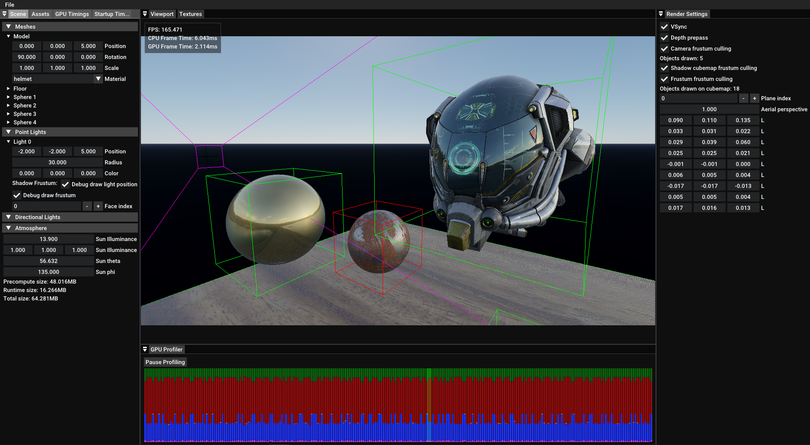

# D3D11 Renderer

A toy renderer and editor written from scratch in C++ using Direct3D 11.



## Features

- PBR materials and image based lighting
- Bruneton's precomputed atmospheric scattering
- Point and directional lights
- PCF shadow maps
- Camera and shadow maps frustum culling
- ImGui based editor
- Custom asset file format loader
- GPU timestamp based profiler

## Build

```
git clone --recursive https://github.com/ramenguy99/D3D11Renderer

cd D3D11Renderer\build
build.bat

Editor.exe
```

The executable is created in the `build` directory and must be executed from there to find the resource files in `../res`.


## Acknowledgements

- Battle Damaged Sci-fi Helmet - PBR by [theblueturtle_](https://sketchfab.com/theblueturtle_), published under a Creative Commons Attribution-NonCommercial license

    https://sketchfab.com/models/b81008d513954189a063ff901f7abfe4

- Small harbor 01 HDRi - published under CC0

    https://polyhaven.com/a/small_harbor_01

- Atmospheric scattering implementation adapted from Bruneton's precomputed atmospheric scattering demo which can be found at:

    https://ebruneton.github.io/precomputed_atmospheric_scattering/
